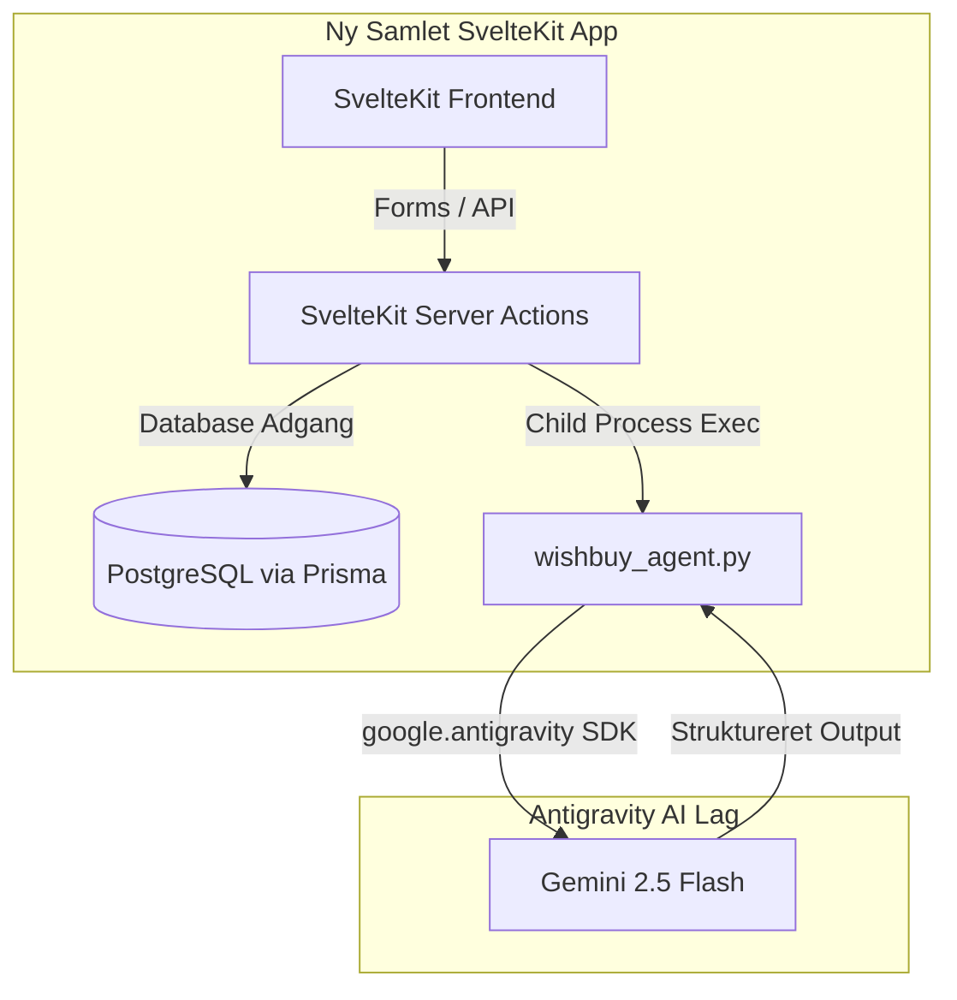

# 📊 Dybdegående Analyse & Assimileringsrapport

## Systemer: `wishbuy` (SvelteKit) & `wishbuy_analytics` (Streamlit)

Dette dokument samler og konsoliderer fundene fra de fire parallelle analyser: **Defensiv Kodestandard & Robusthed (Hardening)**, **Optimering**, **Frontend Traceability** og **API/Database Traceability**. Rapporten slutter med en fuldstændig, eksekverbar arkitektonisk plan for at assimilere `wishbuy_analytics` ind i `wishbuy` samt migrere Gemini-kald til **Antigravity SDK**.

> [!IMPORTANT]
> **Hybrid-arkitektur:** Wishbuy fungerer som en hybrid med to uafhængige forretningsdomæner: **Ønsker (Wishes)** og **Økonomisk Analyse (Finance)**. For at bevare den konceptuelle og funktionelle renhed holdes tabeller og logik for disse domæner skarpt adskilt. Den eneste bro imellem dem er muligheden for at koble en konkret bankudgift (`Transaction`) til det ønske (`Item`), den realiserede.

---

## 🔍 1. Sammenfatning af Analyseresultater

### A. Defensiv Kodestandard & Robusthed (Hardening)

Undersøgelsen identificerede flere kritiske huller og sårbarheder, der kan føre til systemnedbrud eller uautoriseret dataadgang:

- **Blocker: Server-crash på ubehandlet JSON.parse:** SvelteKit server action `bulkGroupToWish` parser en streng uden `try-catch`. Hvis input er ugyldigt, kastes en `SyntaxError`, der crasher servertråden (500 Error).
- **High: Server-crash på datoer (URL-parametre):** SvelteKits `load` funktion i `/dashboard` parses rå URL-parametre (`from`/`to`) uden validering. Hvis datoerne er malformerede, konverteres de til `NaN`, hvilket crasher dato-formateringsfunktionen.
- **High: Stored XSS i Ønske-URL:** Bruger-indtastede links i ønskelisten valideres ikke. Hvis en bruger indtaster et `javascript:` link, vil klik på linket afvikle ondsindet JS-kode i offerets browser.
- **High: Stored XSS i AI Advisor:** AI-genererede indsigter renderes direkte som rå HTML via `{@html marked(...)}` uden sanitering (fx med `DOMPurify`), hvilket tillader injektion af skadelige scripts.
- **High: Authorization Bypass på Svelte actions:** Svelte server actions (`deleteItem`, `toggleStatus`, osv.) validerer ikke, om det forespurgte `itemId` reelt tilhører den loggede bruger.
- **High: Ubeskyttet Streamlit port (8501):** Streamlit-applikationen har ingen indbygget adgangskontrol og er eksponeret direkte på port 8501 på hosten.

### B. Optimering & Performance-Tweaks

Kodebaserne bærer præg af duplikering og unødvendig ressourcebelastning:

- **In-Memory Database Overload (Kritisk):** SvelteKits forside indlæser **samtlige** historiske transaktioner til RAM for at beregne månedens udgifter og kategorisummer. Dette vil sløve appen markant over tid.
- **Duplikerede og Modstridende Kategorier:** Der er tre uafhængige, uoverensstemmende definitioner af transaktionskategorier i `migrate_categories.py`, `mappings.sql` og `migrate_2026.ts`. Hvis de køres uensartet, bryder dashboard-graferne og AI-reglerne.
- **Ineffektiv AI-søgning (Google Search):** Streamlit-appens Gemini-klassificering bruger Google Search som standard på alle transaktions-batches. Det øger svartiden med flere sekunder pr. kald og øger token-forbruget markant.
- **Kompileringsfejl i SvelteKit:** SvelteKit-projektet indeholder compiler-fejl under `npm run check`, herunder hoisting-fejl på variable (`isDarkMode` bruges før definition) og type-fejl på nullable databasedata (`editingCategory.icon`).

### C. Sporbarhed (Traceability)

Systemet tilgår en fælles database, men datamodellerne har skabt overhead:

- **To separate kategorityper (Ønskeliste vs. Transaktioner):**
  - `Category` (Int ID) anvendes udelukkende til at gruppere personlige ønsker/varer (`Item`).
  - `TransactionCategory` (String ID) anvendes udelukkende til banktransaktioner (`Transaction`) og regler (`MappingRule`).
  - _Arkitektonisk beslutning:_ Disse tabeller **skal forblive adskilte** for at forhindre, at transaktionskategorier (som fx "Elregning") optræder i ønskeliste-dropdowns, og omvendt.

---

## 🗺️ 2. Arkitektonisk Assimilations- & Integrationsplan

Assimilationsplanen sigter mod at fjerne `wishbuy_analytics` (Streamlit) helt og samle al logik i en robust, smuk og performant SvelteKit applikation, der bruger **Antigravity SDK** til AI-integrationer.



### Fase A: Databaseoprydning & Kategorisikring

1.  **Ensret transaktionskategorierne:** Vælg den opdaterede kategoriliste fra `migrate_2026.ts` (17 kategorier) og udrul dem til `TransactionCategory` tabellen i databasen.
2.  **Bevar adskillelsen:** Lad `Category` og `TransactionCategory` forblive adskilte enheder.
3.  **Slet døde filer:** Slet `db_analysis.py`, `migrate_categories.py`, `auto_map.py` og udranger Streamlit-containeren (`wishbuy_analytics`).

### Fase B: Porting af Bank-import til SvelteKit

1.  **Ny rute `/dashboard/import`:** Opret en smuk og intuitiv importside i SvelteKit.
2.  **CSV Parsing:** Implementer CSV parsing direkte i SvelteKits server actions ved hjælp af `papaparse` (eller `csv-parse`).
3.  **Duplikat-sikring (MD5 Hashing):** Rekonstruer Streamlits MD5-hashing-algoritme i TypeScript ved brug af Node's `crypto`-modul:
    ```typescript
    import { createHash } from 'crypto';
    const hash = createHash('md5').update(`${dato}${tekst}${beløb}${løbenummer}`).digest('hex');
    ```
4.  **Kort-identifikation & Regler:** Port Streamlits kort-til-betaler regex-regler og søg i `MappingRule` tabellen for at klassificere transaktioner før preview.

### Fase C: Integrering af Antigravity Python SDK

Vi erstatter det gamle `@google/generative-ai` SDK i Node samt det direkte `google-genai` API-kald i Streamlit med et centralt Python-script, der anvender **Antigravity SDK**, ligesom det gøres i `workout`:

1.  **Opret `src/lib/agents/wishbuy_agent.py`:**
    - Dette script vil implementere en `Agent` baseret på `google.antigravity`.
    - Det vil understøtte to handlinger:
      - `analyse`: Overtager SvelteKits AI Advisor indsigt-generering (økonomisk rådgivning).
      - `categorize`: Overtager AI-kategoriseringen af ukendte transaktioner med bulk JSON structured output (pydantic schema) samt valgfri Google Search fallback.
2.  **SvelteKit Exec Integration:**
    - I SvelteKits Server Actions (`+page.server.ts`) kaldes Python-agenten ved hjælp af `child_process.execFile`.
    - Miljøvariabler som `GEMINI_API_KEY` og `DATABASE_URL` videresendes til scriptet.

---

## 🚨 3. Kritiske Hardening og Optimeringsopgaver

Før udrulning skal følgende akutte kodeændringer gennemføres i SvelteKit for at sikre stabilitet og ydeevne:

1.  **Validering og fejlhåndtering i server actions:**
    - Indpak alle `JSON.parse` kald i `try-catch` blokke.
    - Implementer Regex-validering på `from` og `to` dato-parametre i url/load.
    - Tilføj ejerskabstjek på alle actions:
      ```typescript
      const item = await prisma.item.findUnique({ where: { id: itemId } });
      if (!item || item.userId !== locals.user.id) return fail(403, { error: 'Adgang nægtet.' });
      ```
2.  **Input-validering og XSS-sikring:**
    - Afvis ønsker med URL'er, der ikke starter med `http://` eller `https://`.
    - Installer og integrer `isomorphic-dompurify` til at sanitere AI-markdown output i `+page.svelte`.
3.  **Database Performance-Tweak:**
    - Erstat in-memory loops over tusindvis af transaktioner med Prisma SQL `aggregate` (`_sum`) og `groupBy` i databaselaget.
4.  **Fiksering af Svelte compiler-fejl:**
    - Flyt `let isDarkMode = $state(false)` til toppen af `<script>` i `/dashboard/+page.svelte`.
    - Opdater TypeScript types til at acceptere nullable ikoner på kategorier.
